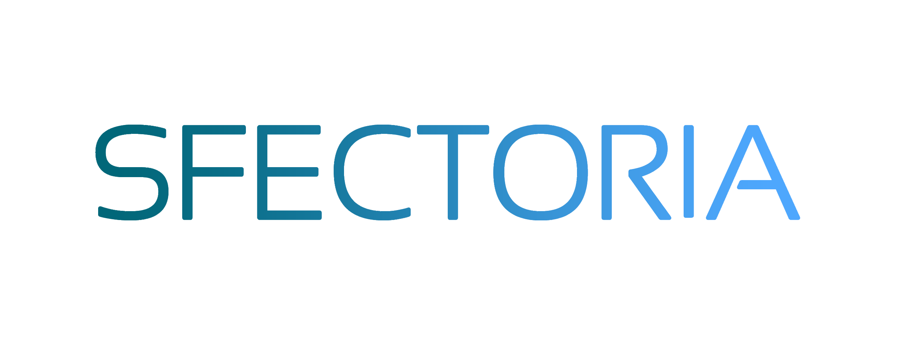

# SFectoria E-commerce Project

This project is an eCommerce platform built with React.js in the frontend, Nest.js and Prisma in the backend, using Turbo.js for managing workspaces.


<p align="center">
  <a href="http://sfectoria.com/" target="blank"></a>
</p>


### Prerequisites
    - Node.js
    - Yarn package manager
# Getting Started


### Installation

1. Clone the repository:

   ```bash
   git clone https://github.com/sfectoria-fabskill/ecommerce
   cd ecommerce
2. Install dependencies:
     ```bash
        yarn install
3. Create a PostgreSQL database named sfectoria_ecommerce.
    Database Migration
Run Prisma migrations:
    ```bash
        yarn migrate:reset
### Starting the Project

1. Install dependencies:
    ```bash 
         yarn start
2. Swagger API documentation : 
    Visit http://localhost:3001/api for Swagger documentation.


## Technologies Used

- **Frontend:**
  - React.js
  - React-Bootstrap

- **Backend:**
  - Nest.js
  - Prisma
  - PostgreSQL

- **Additional Tools:**
  - Swagger 
  - Turbo.js
  - Yarn
  - Git


